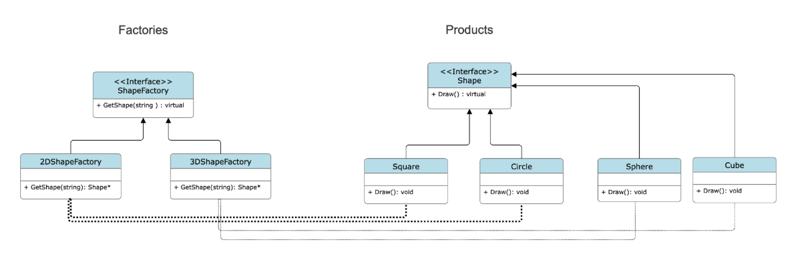
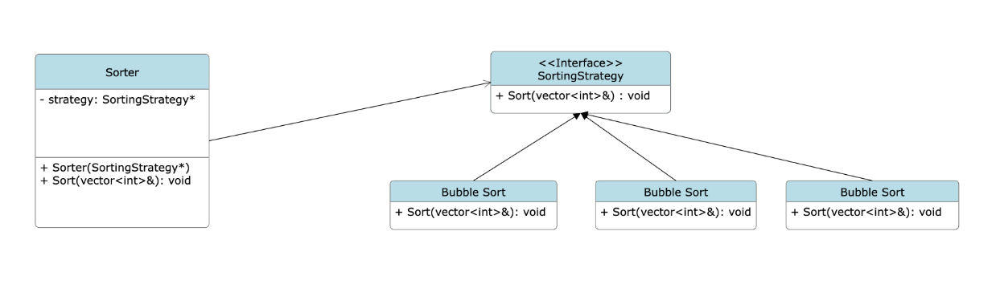

# Design Patterns Overview

This document summarizes key design patterns—**Factory**, **Singleton**, and **Strategy**—with their **pros and cons**, along with **UML-style diagrams**.

---

## 🏭 Factory Pattern

**Definition**:  
A creational design pattern that provides an interface for creating objects in a superclass but allows subclasses to alter the type of objects that will be created.

### ✅ Pros
1. **Loose Coupling** – Clients use an abstract interface, not concrete classes.
2. **Single Responsibility** – Centralizes object creation logic.
3. **Open/Closed Principle** – Add new products without changing existing code.

### ❌ Cons
1. Code can become **complex**, requiring many **subclasses** and **interfaces**.

### 🖼️ Diagram  

---

## 👤 Singleton Pattern

**Definition**:  
A **creational pattern** that ensures a class has only **one instance** and provides a **global access point** to it.

### ✅ Pros
1. **Controlled access** to a single instance.
2. **Memory efficiency** – no duplicate instances.
3. Useful for managing **shared resources** (e.g., database connections, logging).

### ❌ Cons
1. **Difficult to unit test** due to global state.
2. May become a **bottleneck** in multithreaded applications.
3. **Hidden dependencies** and **tight coupling** can make code harder to understand and maintain.

### 🖼️ Diagram  

---

## 🔁 Strategy Pattern

**Definition**:  
A **behavioral design pattern** that enables selecting an algorithm's behavior at runtime by encapsulating each algorithm in its own class.

### ✅ Pros
1. **Strategy can be changed at runtime** without modifying the context.
2. Each algorithm is encapsulated in its own class – promotes **single responsibility**.
3. **Open/Closed Principle** – Easily extendable by adding new strategies.

### ❌ Cons
1. Increases the number of classes.
2. The client must be aware of the strategy interface to use it.
3. Slight overhead from delegation.

### 🖼️ Diagram  

---

## 📚 References

- "Design Patterns: Elements of Reusable Object-Oriented Software" by GoF
- "Introduction to Algorithms" by Cormen et al. (used for consistent algorithm style)

---

## 🛠️ Usage Tips

- Use **Factory** when you need decoupling between object creation and usage.
- Use **Singleton** for shared resources (with thread safety in mind).
- Use **Strategy** when you want to swap behaviors or algorithms dynamically.

---
